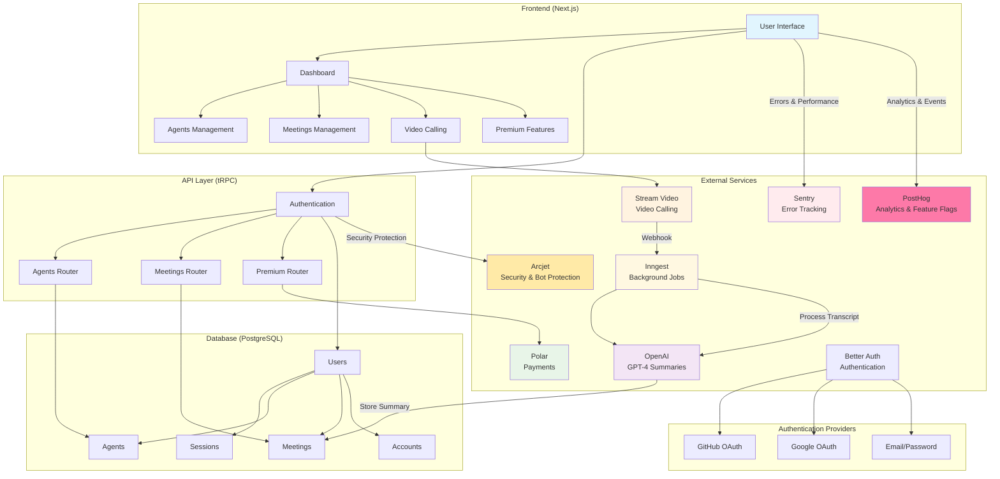

# Meetique Architecture Diagram

```mermaid
flowchart TB
    subgraph "Frontend (Next.js)"
        A[User Interface] --> B[Dashboard]
        B --> C[Agents Management]
        B --> D[Meetings Management]
        B --> E[Video Calling]
        B --> F[Premium Features]
    end

    subgraph "API Layer (tRPC)"
        G[Authentication] --> H[Agents Router]
        G --> I[Meetings Router]
        G --> J[Premium Router]
    end

    subgraph "Database (PostgreSQL)"
        K[Users] --> L[Sessions]
        K --> M[Agents]
        K --> N[Meetings]
        K --> O[Accounts]
    end

    subgraph "External Services"
        P[Stream Video<br/>Video Calling]
        Q[OpenAI<br/>GPT-4 Summaries]
        R[Polar<br/>Payments]
        S[Better Auth<br/>Authentication]
        T[Inngest<br/>Background Jobs]
        X[Sentry<br/>Error Tracking]
        Y[Arcjet<br/>Security & Bot Protection]
        Z[PostHog<br/>Analytics & Feature Flags]
    end

    subgraph "Authentication Providers"
        U[GitHub OAuth]
        V[Google OAuth]
        W[Email/Password]
    end

    A --> G
    G --> K
    H --> M
    I --> N
    J --> R

    E --> P
    T --> Q
    S --> U
    S --> V
    S --> W

    P --> |Webhook| T
    T --> |Process Transcript| Q
    Q --> |Store Summary| N
    A --> |Errors & Performance| X
    G --> |Security Protection| Y
    A --> |Analytics & Events| Z

    style A fill:#e1f5fe
    style P fill:#fff3e0
    style Q fill:#f3e5f5
    style R fill:#e8f5e8
    style T fill:#fff8e1
    style X fill:#ffebee
    style Y fill:#ffeaa7
    style Z fill:#fd79a8
```
