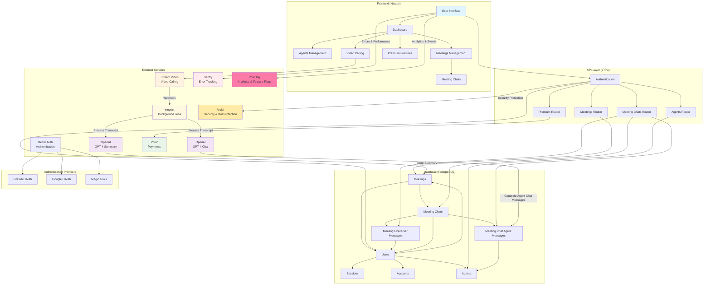

# Meetique Architecture Diagram

```mermaid
flowchart TB
    subgraph "Frontend (Next.js)"
        USER_INTERFACE[User Interface] --> DASHBOARD[Dashboard]
        DASHBOARD --> AGENTS_MANAGEMENT[Agents Management]
        DASHBOARD --> MEETINGS_MANAGEMENT[Meetings Management]
        MEETINGS_MANAGEMENT --> MEETING_CHATS[Meeting Chats]
        DASHBOARD --> VIDEO_CALLING[Video Calling]
        DASHBOARD --> PREMIUM_FEATURES[Premium Features]
    end

    subgraph "API Layer (tRPC)"
        AUTHENTICATION[Authentication] --> ROUTER_AGENTS[Agents Router]
        AUTHENTICATION --> ROUTER_MEETINGS[Meetings Router]
        AUTHENTICATION --> ROUTER_PREMIUM[Premium Router]
        AUTHENTICATION --> ROUTER_MEETING_CHATS[Meeting Chats Router]
    end

    subgraph "Database (PostgreSQL)"
        TABLE_USERS[Users] --> TABLE_SESSIONS[Sessions]
        TABLE_USERS --> TABLE_ACCOUNTS[Accounts]
        TABLE_USERS --> TABLE_AGENTS[Agents]
        TABLE_USERS --> TABLE_MEETINGS[Meetings]
        TABLE_MEETINGS --> TABLE_MEETING_CHATS[Meeting Chats]
        TABLE_MEETINGS --> TABLE_USERS
        TABLE_MEETING_CHATS --> TABLE_MEETING_CHAT_USER_MESSAGE[Meeting Chat User Messages]
        TABLE_MEETING_CHATS --> TABLE_MEETING_CHAT_AGENT_MESSAGE[Meeting Chat Agent Messages]
    end

    subgraph "External Services"
        SERVICE_STREAM[Stream Video<br/>Video Calling]
        SERVICE_OPENAI_SUMMARY[OpenAI<br/>GPT-4 Summary]
        SERVICE_OPENAI_CHAT[OpenAI<br/>GPT-4 Chat]
        SERVICE_POLAR[Polar<br/>Payments]
        SERVICE_BETTER_AUTH[Better Auth<br/>Authentication]
        SERVICE_INNGEST[Inngest<br/>Background Jobs]
        SERVICE_SENTRY[Sentry<br/>Error Tracking]
        SERVICE_ARCJET[Arcjet<br/>Security & Bot Protection]
        SERVICE_POSTHOG[PostHog<br/>Analytics & Feature Flags]
    end

    subgraph "Authentication Providers"
        AUTH_GITHUB[GitHub OAuth]
        AUTH_GOOGLE[Google OAuth]
        AUTH_MAGIC_LINKS[Magic Links]
    end

    USER_INTERFACE --> AUTHENTICATION
    AUTHENTICATION --> TABLE_USERS
    ROUTER_AGENTS --> TABLE_AGENTS
    ROUTER_MEETINGS --> TABLE_MEETINGS
    ROUTER_PREMIUM --> SERVICE_POLAR
    ROUTER_MEETING_CHATS --> TABLE_MEETING_CHATS
    ROUTER_MEETING_CHATS --> TABLE_MEETING_CHAT_AGENT_MESSAGE
    ROUTER_MEETING_CHATS --> TABLE_MEETING_CHAT_USER_MESSAGE

    VIDEO_CALLING --> SERVICE_STREAM
    SERVICE_BETTER_AUTH --> AUTH_GITHUB
    SERVICE_BETTER_AUTH --> AUTH_GOOGLE
    SERVICE_BETTER_AUTH --> AUTH_MAGIC_LINKS

    TABLE_MEETING_CHAT_USER_MESSAGE --> TABLE_USERS
    TABLE_MEETING_CHAT_AGENT_MESSAGE --> TABLE_AGENTS
    TABLE_MEETING_CHATS --> TABLE_USERS

    SERVICE_STREAM --> |Webhook| SERVICE_INNGEST
    SERVICE_INNGEST --> |Process Transcript| SERVICE_OPENAI_SUMMARY
    SERVICE_INNGEST --> |Process Transcript| SERVICE_OPENAI_CHAT
    SERVICE_OPENAI_SUMMARY --> |Store Summary| TABLE_MEETINGS
    SERVICE_OPENAI_CHAT --> |Generate Agent Chat Messages| TABLE_MEETING_CHAT_AGENT_MESSAGE
    USER_INTERFACE --> |Errors & Performance| SERVICE_SENTRY
    AUTHENTICATION --> |Security Protection| SERVICE_ARCJET
    USER_INTERFACE --> |Analytics & Events| SERVICE_POSTHOG

    style USER_INTERFACE fill:#e1f5fe
    style SERVICE_STREAM fill:#fff3e0
    style SERVICE_OPENAI_SUMMARY fill:#f3e5f5
    style SERVICE_OPENAI_CHAT fill:#f3e5f5
    style SERVICE_POLAR fill:#e8f5e8
    style SERVICE_INNGEST fill:#fff8e1
    style SERVICE_SENTRY fill:#ffebee
    style SERVICE_ARCJET fill:#ffeaa7
    style SERVICE_POSTHOG fill:#fd79a8
```
